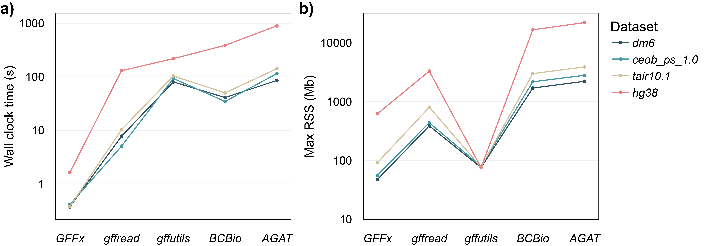

# GFFx Command Line Manual

**GFFx** is a high-performance, Rust-based toolkit for extracting and querying annotations from GFF3 files. It supports fast indexing and feature retrieval with several subcommands.
It can be used both as a **command-line tool** and as a **Rust library**. 

<p align="center">
  
  <br>
  <em>Benchmarking runtime and memory usage of ID-based feature extraction</em>
</p>

---

## Breaking Changes

Added two useful functionalities: `coverage` for calculating breadth of coverage and `depth` for calculating depth of coverage from BAM/SAM/CRAM or BED files on a GFF file.

Added a `sample` functionality for random downsampling of feature groups from each chromosome at equal ratios.

Updated module organization and source code directory layout to conform to the Rust 2024 edition guidelines for module visibility (`pub`) and path imports.

---

## Table of Contents

*GFFx version 0.4.0*

---

- [Installation](#installation)
- [Basic Usage](#basic-usage)
  - [index](#index) - Build index files
  - [extract](#extract) - Extract features by ID
  - [intersect](#intersect) - Extract features by regions
  - [search](#search) - Search features by attributes
  - [coverage](#coverage) - Calculate coverage breadth
  - [depth](#depth) - Calculate coverage depth
  - [sample](#sample) - Randomly downsample feature groups


- [Example Use Cases](#example-use-cases)
- [Using GFFx as a Rust Library](#using-gffx-as-a-rust-library)
- [Available Public APIs](#available-public-apis)
- [Index File Types](#index-file-types)
- [License](#license)
- [Citation](#citation)

---
## Installation

### Option 1: Install via [crates.io](https://crates.io/crates/gffx)

```bash
cargo install gffx                  # install to default location (~/.cargo/bin)
cargo install gffx --root /your/path  # optional: install to custom location
```

### Option 2: Install from source

```bash
git clone https://github.com/Baohua-Chen/GFFx.git
cd GFFx
cargo build --release
# Optionally copy the binary
cp target/release/gffx /your/path
```

> Requires **Rust 1.70 or later**. You can install or update Rust using [rustup](https://rustup.rs).
---


## Basic Usage

```bash
gffx <SUBCOMMAND> [OPTIONS]
```

Available subcommands:

- [index] Build index files
- [intersect] Extract features by region
- [extract] Extract features by ID
- [search] Search features by attribute

---

### `index`

Builds index files from a GFF file to accelerate downstream operations.

```bash
gffx index [OPTIONS] --input <INPUT>
```

**Options:**

| Option                 | Description                                     |
|------------------------|-------------------------------------------------|
| `-i`, `--input`        | Input GFF file                                  |
| `-a`, `--attribute`    | Attribute key to extract (default: `gene_name`) |
| `-v`, `--verbose`      | Enable verbose output                           |
| `-h`, `--help   `      | Print help                                      |

---

### `intersect`

Extracts models intersecting with regions from a GFF file, either from a single region or a BED file.

```bash
gffx intersect [OPTIONS] --input <INPUT> <--region <REGION>|--bed <BED>>
```

**Options:**
Required
| Option                      | Description                                                  |
| --------------------------- | ------------------------------------------------------------ |
| `-i`, `--input` `<INPUT>`   | Input GFF file path                                          |
| `-r`, `--region` `<REGION>` | Single region in `chr:start-end` format                      |
| `-b`, `--bed` `<BED>`       | BED file containing multiple regions                         |

> **Note**: Exactly one of `--region` or `--bed` must be specified.


Optional
| Option                      | Description                                                                    |
| -------------------------   | ------------------------------------------------------------------------------ |
| `-o`, `--output` `<OUT>`    | Output file path (default: stdout)                                             |
| `-e`, `--entire-group`      | Enable the "entire-group" mode. Return entire gene models or feature groups    |
|                             | for all matched features, instead of only the directly matched features.       |
| `-v`, `--invert`            | Invert selection (exclude matched features)                                    |
| `-T`, `--types` `<TYPES>`   | Filter output to include only features of specified types (e.g., `gene,exon`)  |
| `-t`, `--threads` `<NUM>`   | Number of threads [default: 12]                                                |
| `-V`, `--verbose`           | Enable verbose output                                                          |
| `-h`, `--help`              | Show help message                                                              |
| *(one of)*                  |                                                                                |
| `-c`, `--contained`         | Only keep features fully contained within the region                           |
| `-C`, `--contains-region`   | Only keep features that fully contain the region                               |
| `-O`, `--overlap`           | Keep features that partially or fully overlap (default mode)                   |

---

### `extract`

Extracts annotation models by feature ID(s), including their parent models.

```bash
gffx extract [OPTIONS] --input <INPUT> <--feature-file <FEATURE_FILE>|--feature-id <FEATURE_ID>>
```

**Options:**

Required
| Option                                   | Description                                                  |
| ---------------------------------------- | ------------------------------------------------------------ |
| `-i`, `--input` `<INPUT>`                | Input GFF file path                                          |
| *(one of)*                               |                                                              |
| `-f`, `--feature-id` `<FEATURE_ID>`      | Extrach by a single feature id                               |
| `-e`, `--feature-file` `<FEATURE_FILE>`  | Extrach by a BED file containing multiple regions            |

Optional
| Option                      | Description                                                                    |
| -------------------------   | ------------------------------------------------------------------------------ |
| `-o`, `--output` `<OUT>`    | Output file path (default: stdout)                                             |
| `-e`, `--entire-group`      | Enable the "entire-group" mode. Return entire gene models or feature groups    |
|                             | for all matched features, instead of only the directly matched features.       |
| `-T`, `--types` `<TYPES>`   | Filter output to include only features of specified types (e.g., `gene,exon`)  |
| `-t`, `--threads` `<NUM>`   | Number of threads [default: 12]                                                |
| `-V`, `--verbose`           | Enable verbose output                                                          |
| `-h`, `--help`              | Show help message                                                              |

---

### `search`

Searches for features using a specified attribute value and retrieves the full annotation models.

```bash
gffx search -a geneX -i input.gff
```

**Options:**

Required
| Option                                   | Description                                                  |
| ---------------------------------------- | ------------------------------------------------------------ |
| `-i`, `--input` `<INPUT>`                | Input GFF file path                                          |
| *(one of)*                               |                                                              |
| `-a`, `--attr` `<ATTRIBUTE_VALUE>`        | Search a single attribute value/pattern                      |
| `-A`, `--attr-list` `<ATTRIBUTE_LIST>`   | Search attribute values/patterns defined in a text file      |

Optional
| Option                      | Description                                                                    |
| -------------------------   | ------------------------------------------------------------------------------ |
| `-o`, `--output` `<OUT>`    | Output file path (default: stdout)                                             |
| `-e`, `--entire-group`      | Enable the "entire-group" mode. Return entire gene models or feature groups    |
|                             | for all matched features, instead of only the directly matched features.       |
| `-r`, `--regex` `<REGEX>`   | Enable regex matching for attribute values                                     |
| `-T`, `--types` `<TYPES>`   | Filter output to include only features of specified types (e.g., `gene,exon`)  |
| `-t`, `--threads` `<NUM>`   | Number of threads [default: 12]                                                |
| `-V`, `--verbose`           | Enable verbose output                                                          |
| `-h`, `--help`              | Show help message                                                              |

---

### `coverage`

Compute coverage breadth across genomic feature.

```bash
gffx coverage -i input.gff -s source.bam
```

**Options:**

Required
| Option                                   | Description                                                  |
| ---------------------------------------- | ------------------------------------------------------------ |
| `-i`, `--input` `<INPUT>`                | Input GFF file path                                          |
| `-s`, `--source` `<SOURCE>`              | Source file in BAM/SAM/CRAM or BED format                    |

Optional
| Option                      | Description                                                                    |
| -------------------------   | ------------------------------------------------------------------------------ |
| `-o`, `--output` `<OUT>`    | Output file path (default: stdout)                                             |
| `-e`, `--entire-group`      | Enable the "entire-group" mode. Return entire gene models or feature groups    |
|                             | for all matched features, instead of only the directly matched features.       |
| `-t`, `--threads` `<NUM>`   | Number of threads [default: 12]                                                |
| `-V`, `--verbose`           | Enable verbose output                                                          |
| `-h`, `--help`              | Show help message                                                              |

---

### `depth`

Compute coverage depth across genomic feature.

```bash
gffx depth -i input.gff -s source.bam
```

**Options:**

Required
| Option                                   | Description                                                  |
| ---------------------------------------- | ------------------------------------------------------------ |
| `-i`, `--input` `<INPUT>`                | Input GFF file path                                          |
| `-s`, `--source` `<SOURCE>`              | Source file in BAM/SAM/CRAM or BED format                    |

Optional
| Option                      | Description                                                                    |
| -------------------------   | ------------------------------------------------------------------------------ |
| `-o`, `--output` `<OUT>`    | Output file path (default: stdout)                                             |
| `--bin-shift` `<BIN_SHIFT>` | Bin width parameter (2^k bp) for spatial bucketing of features and queries.    |
|                             | Choose k so that a typical read and feature span ~1–2 bins [default: 12]       |
| `-e`, `--entire-group`      | Enable the "entire-group" mode. Return entire gene models or feature groups    |
|                             | for all matched features, instead of only the directly matched features.       |
| `-t`, `--threads` `<NUM>`   | Number of threads [default: 12]                                                |
| `-V`, `--verbose`           | Enable verbose output                                                          |
| `-h`, `--help`              | Show help message                                                              |

---

### `sample`

Ramdomly downsample feature groups.

```bash
gffx sample -i input.gff -r 0.33
```

**Options:**

Required
| Option                                   | Description                                                  |
| ---------------------------------------- | ------------------------------------------------------------ |
| `-i`, `--input` `<INPUT>`                | Input GFF file path                                          |
| `-r`, `--ratio` `<RATIO>`                | Ratio of downsampling, should be between 0 and 1             |

Optional
| Option                      | Description                                                                    |
| -------------------------   | ------------------------------------------------------------------------------ |
| `-o`, `--output` `<OUT>`    | Output file path (default: stdout)                                             |
| `-t`, `--threads` `<NUM>`   | Number of threads [default: 12]                                                |
| `-V`, `--verbose`           | Enable verbose output                                                          |
| `-h`, `--help`              | Show help message                                                              |

---

## Example Use Cases

```bash
# Build index
gffx index -i genes.gff -a gene_name

# Extract all features overlapping with a region
gffx intersect --region chr1:10000-20000 -i genes.gff -o out.gff -F

# Extract models from a list of gene IDs
gffx extract --feature-file genes.txt -i genes.gff -o subset.gff -F

# Search by gene name and extract the full model
gffx search -a TP53 -i genes.gff -o tp53_model.gff

```

---

## Using GFFx as a Rust Library

You can use GFFx as a Rust library in your own project.

### Add to Cargo.toml

```toml
[dependencies]
gffx = "^0.2.0" # Please check the latest version in crates.io
```

### Example: Manually extract features from region using index files
The following example runs inside a main() -> Result<()> context:

```rust
use anyhow::{Result, bail};
use std::path::Path; 

pub fn extract_one_id_full_model(                       // Define a minimal single-ID full-model extractor
    gff_path: &Path,                                    // Path to the input GFF file
    feature_id: &str,                                   // Target feature ID (string form)
    out_path: &Path                                     // Path to the output GFF file
) -> Result<()> {                                       // Return anyhow::Result for error propagation
    let fts = load_fts(gff_path)?;                      // Load feature table: maps string IDs <-> numeric fids
    let prt = load_prt(gff_path)?;                      // Load parent relations: map child fid -> root fid
    let gof = load_gof(gff_path)?;                      // Load offsets: map root fid -> byte ranges in the file

    let (fid_set, missing) = fts.map_fnames_to_fids(    // Map the single feature name to a numeric fid via batch API
        std::iter::once(feature_id.to_string()).collect(), // Build a one-element set of the feature name
        1                                               // Use 1 thread since this is a single lookup
    );                                                  
    
    let fid = *fid_set.iter().next().unwrap();          // Extract the only fid from the set

    let root = prt.map_fids_to_roots(&[fid], 1)[0];     // Map fid -> root fid using the batch API with a single item

    let blocks = gof.roots_to_offsets(&[root], 1);      // Convert the root fid to file block offsets (full model span)

    write_gff_output(                                   // Write the entire blocks (full-model output, no filtering)
        gff_path,                                       // Input GFF file path
        &blocks,                                        // Byte-range blocks to emit
        out_path,                                       // Output file path
        false                                           // Verbose: false for minimal logging
    )?;                                                 

    Ok(())                                              // Return success
}                                                       // End of function
```

---

## Available Public APIs

### Index building & checking (`index_builder`)
- `build_index`

### Index loading (`index_loader`)
- `load_gof`, `load_prt`, `load_fts`, `load_atn`, `load_a2f`, `load_sqs`
- `safe_mmap_readonly`
- `GofMap`, `PrtMap`, `FtsMap`, `A2fMap`

### Interval querying data structures (`utils::serial_interval_trees`)
- `IntervalTree`, `Interval`
- `save_multiple_trees`, `write_offsets_to_file`

### Other utilities (`utils::common`)
- `CommonArgs`, `append_suffix`
- `write_gff_output`, `write_gff_output_filtered`
- `check_index_files_exist`

---


## Index File Types

| File Extension | Purpose                                             |
|----------------|-----------------------------------------------------|
| `.gof`         | Byte offset index for GFF feature blocks            |
| `.fts`         | Feature ID table                                    |
| `.prt`         | Child to parent mapping                             |
| `.a2f`         | Attribute to feature ID mapping                     |
| `.atn`         | Attribute value table                               |
| `.sqs`         | Sequence ID table                                   |
| `.rit`         | Interval tree index                                 |
| `.rix`         | Byte offest index for interval trees in.rit file    |

---

## Notes

- Make sure you run `gffx index` before using `intersect`, `extract`, or `search`.

---

## License

GFFx is released under the MIT or Apache-2.0 License.

---

## Citation

If you use **GFFx**, please cite our forthcoming paper in **GigaScience**:
Chen, B., Wu, D., & Zhang, G. (in press). GFFx: A Rust-based suite of utilities for ultra-fast genomic feature extraction. GigaScience. https://doi.org/10.1093/gigascience/giaf124
---
